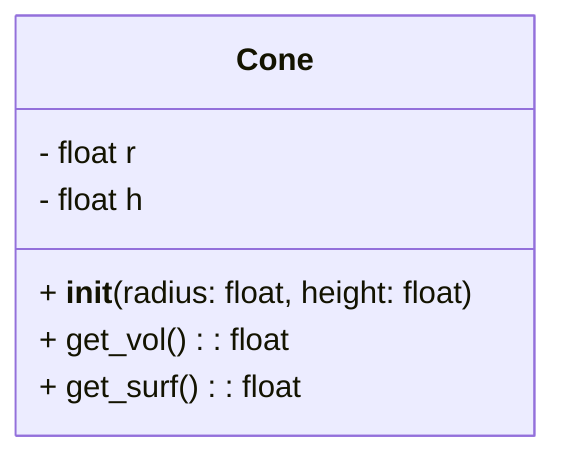
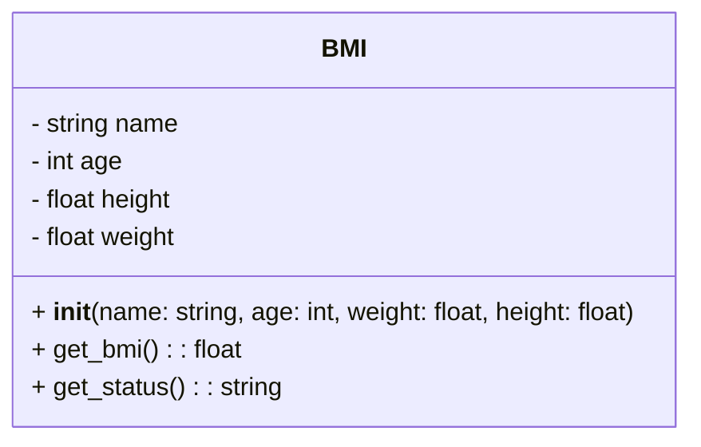

# 10강 - 객체지향

## 객체지향의 이해

### 객체지향의 개념

- 객체와 객체 사이의 상호작용으로 프로그램을 구성하는 프로그래밍 패러다임
- 프로그램을 유연하고 변경을 쉽게 만들어 대규모 소프트웨어 개발에 사용
- 객체지향 패러다임의 특징
    - **추상화**: 공통의 속성이나 기능을 도출
    - **캡슐화**: 데이터 구조와 데이터의 연결을 결합
    - **상속**: 상위 개념의 특징이 하위 개념에 전달
    - **다형성**: 유사 객체의 사용성을 그대로 유지

### 객체와 클래스

- 객체는 **추상화**와 **캡슐화**의 결과
- 실세계의 사물에 대한 상태(데이터)와 연산(메소드)을 표현한 단위
- 멤버(데이터 필드, 메소드)는 클래스에 의해 결정됨

#### 클래스 정의

##### 구문 형식

```python
class 클래스이름:
    초기자 정의
    메소드 정의
```

##### 메소드

- 객체에 대한 행동을 정의
- 함수의 정의 및 사용 방법과 동일
- `self` 매개변수
    - 모든 메소드의 첫 번째 매개변수
    - 메소드의 구현에 사용되지만, 메소드 호출 시 명시하지 않음
    - 객체 자신을 참조하여 클래스 정의에 포함된 멤버에 접근할 때 사용
    - `self`는 자바의 `this`와 동일한 역할을 하지만, 파이썬에서는 반드시 명시해야 함

```python
class 클래스이름:
    def 메소드이름(self, 매개변수 리스트):
        코드 블록
```

##### 초기자

- 객체의 상태를 초기화하는 특수 메소드
- 항상 `__init__`으로 명명됨

#### 원뿔 계산 프로그램 개선

```python
class Cone:
    def __init__(self, radius=20, height=30):
        self.r = radius
        self.h = height

    def get_vol(self):
        return (1 / 3) * 3.14 * self.r ** 2 * self.h

    def get_surf(self):
        return 3.14 * self.r ** 2 + 3.14 * self.r * self.h
```

#### 클래스 설계

- UML 클래스 다이어그램을 통해 데이터 필드, 생성자, 메소드 표현 방법을 표준화
- 클래스가 어떻게 설계되었는지 표현



#### BMI 계산 프로그램

- 이름, 나이, 몸무게, 키를 사용하여 BMI 수치 및 상태를 반환하는 BMI 클래스 정의

```python
class BMI:
    def __init__(self, name, age, weight, height):
        self.name = name
        self.age = age
        self.height = height
        self.weight = weight

    def get_bmi(self):
        return self.weight / (self.height / 100) ** 2

    def get_status(self):
        bmi = self.get_bmi()
        if bmi >= 25:
            return "비만"
        elif 23 <= bmi < 25:
            return "과체중"
        elif 18.5 <= bmi < 23:
            return "정상"
        else:
            return "저체중"
```



## 클래스와 인스턴스

### 객체와 인스턴스

```python
클래스이름(초기자 파라미터)
```

- 클래스의 생성자를 통해 인스턴스 생성
- 객체와 인스턴스는 동일 개념
- 클래스의 생성자는 클래스의 이름과 동일
- 클래스의 이름과 초기자의 매개변수를 사용하여 생성자 호출

### 객체의 사용

- 객체의 데이터 필드 접근 및 메소드 호출
- 객체 멤버 접근 연산자(`.`) 사용

```python
객체참조변수.데이터필드
객체참조변수.메소드(파라미터)
```

- 객체 참조 변수를 사용하여 객체를 생성

```python
객체참조변수 = 클래스이름(초기자 파라미터)
```

#### 원뿔 겉넓이 계산 프로그램 사용

```python
unit_cone = Cone()
big_cone = Cone(50, 100)

print("단위 원뿔의 겉넓이와 부피:", unit_cone.get_surf(), unit_cone.get_vol())
print("큰 원뿔의 겉넓이와 부피:", big_cone.get_surf(), big_cone.get_vol())
```

#### BMI 계산 프로그램 사용

```python
person1 = BMI("홍길동", 40, 78, 182)
print(f"{person1.name}님({person1.age}세)의 BMI 수치는 {person1.get_bmi()}이며, 결과는 {person1.get_status()}입니다.")
```

## 객체지향의 활용

### 데이터 타입과 객체

```python
number = 20
print(type(number))
print(id(number))

symbol = "파이썬"
print(type(symbol))
print(id(symbol))
```

### 데이터 은닉

- `unitcone.r`은 public 속성이므로 음수가 들어갈 수 있음
- 이를 방지하기 위해 **데이터 은닉**이 필요

#### 코드 개선 (캡슐화 적용)

```python
class Cone:
    def __init__(self, radius=20, height=30):
        if radius > 0 and height > 0:
            self.__r = radius
            self.__h = height

    def get_vol(self):
        return (1 / 3) * 3.14 * self.__r ** 2 * self.__h

    def get_surf(self):
        return 3.14 * self.__r ** 2 + 3.14 * self.__r * self.__h

    def set_radius(self, radius):
        if radius > 0:
            self.__r = radius

    def set_height(self, height):
        if height > 0:
            self.__h = height

    def get_radius(self):
        return self.__r

    def get_height(self):
        return self.__h

cone = Cone(50, 10)
print(cone.get_vol())
print(cone.get_surf())
```