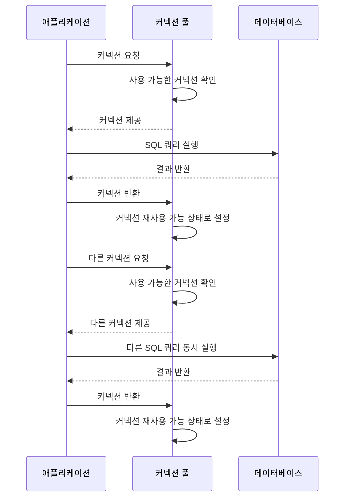

[커넥션](DB%20Connection.md#^52338f) 에서 설명 했듯이 커넥션 은 DB 에서 굉장히 중요한 자원 이며 이를 **잘 관리하는 것** 은 어플리케이션 성능 에 굉장히 중요한 역할을 한다. 
<br/>
그리고 [ 커넥션 코드](DB%20Connection.md#^b425b7) 부분에서 매번 커넥션을 생성하고 끊는 작업은 굉장히 비효율 적이며 속도에도 큰 영향을 미치기 때문에 현재에는 **커넥션 풀** 이란 개념을 사용 하여 커넥션을 효율적으로 관리한다.

# Connection pool

**Connection pool** 은 직역해보면 "커넥션의 수영장" 이라고 할수있다. 어플리케이션이 실행과 동시에 일정량의 커넥션을 *미리* 생성하여 커넥션을 맺어 통신하는 시간을 단축하며, 커넥션을 *재사용*함으로써  애플리케이션의 성능을 획기적으로 올리는 개념이다.

그리고 이러한 **Connection pool** 생성 및 관리하는 소프트웨어 들이 존재하고 `Spring Boot` 에서는 `HikariCP` 를 기본적으로 사용한다. 

이 외에도 Tomcat pooling DataSource, Commons DBCP2, Oracle UCP 와 같이 다양한 소프트웨어가 존재한다.


# Connection pool 의 동시 처리




1. 애플리케이션이 커넥션 풀에 커넥션을 요청합니다.
2. 커넥션 풀은 사용 가능한 커넥션을 확인하고 제공합니다.
3. 애플리케이션은 제공받은 커넥션을 사용하여 데이터베이스에 SQL 쿼리를 실행합니다.

예를 들어, 첫 번째 쿼리가 다음과 같을 수 있습니다:

```sql
SELECT * FROM users WHERE id = 1;
```

4. 데이터베이스가 결과를 반환하고, 애플리케이션은 커넥션을 풀에 반환합니다.
5. 커넥션 풀은 반환된 커넥션을 재사용 가능한 상태로 설정합니다.

동시에, 다른 요청이 들어올 수 있습니다:

6. 다른 애플리케이션 스레드가 커넥션 풀에 새로운 커넥션을 요청합니다.
7. 커넥션 풀은 다시 사용 가능한 커넥션을 확인하고 제공합니다.
8. 새로운 스레드는 이 커넥션을 사용하여 다른 SQL 쿼리를 실행합니다.

예를 들어, 두 번째 쿼리가 다음과 같을 수 있습니다:

```sql
INSERT INTO orders (user_id, product_id, quantity) VALUES (1, 100, 2);
```

9. 데이터베이스가 결과를 반환하고, 애플리케이션은 이 커넥션도 풀에 반환합니다.
10. 커넥션 풀은 이 커넥션도 재사용 가능한 상태로 설정합니다.

이러한 방식으로, 커넥션 풀은 여러 요청을 동시에 처리할 수 있게 해줍니다. 각 요청은 풀에서 사용 가능한 커넥션을 받아 데이터베이스 작업을 수행하고, 작업이 완료되면 커넥션을 다시 풀에 반환합니다. 이를 통해 커넥션 생성 및 해제의 오버헤드를 줄이고, 리소스를 효율적으로 관리할 수 있습니다.

## HikariCP

다음은 [[https://github.com/brettwooldridge/HikariCP|HikariCP 공식|]] 에서 JDBC 와 HikariCP 를 사용했을때의 성능을 나타내며 **Connection Cycle ops/ms** 에서는 커넥션의 `생성` 과 `제거` 를 했을때 의 속도를 비교한 그래프 이며   **Statement Cycle ops/ms**는 **Connection.prepareStatement(), Statement.execute(), Statement.close() 데이터** 베이스의 상태로 준비 > 수행 > 종료 단계를 비교 측정한 내용 이다.


HikariCP 는 애플리케이션에서 데이터베이스에 쿼리를 실행하기 위해 커넥션을 요청하면,  **커넥션 풀**에서 사용 가능한 커넥션을 찾아 반환합니다.

만약 **사용 가능한 커넥션이 있으면** 즉시 해당 커넥션이 반환되고, 애플리케이션은 이를 사용해 쿼리를 실행할 수 있습니다.

**사용 가능한 커넥션이 없는 경우**  HikariCP는 풀에 설정된 **최대 커넥션 수**(max pool size)에 도달하지 않았다면, 새로운 커넥션을 생성하여 반환하며

만약 최대 커넥션 수에 이미 도달한 상태라면, **커넥션을 반환받을 때까지 대기**하거나, **대기 시간이 초과**하면 `SQLException`이 발생합니다.


### HikariCP 설정

```yml
hikari:  
  connection-timeout: 3000
  maximum-pool-size: 15
  max-lifetime: 30000 
  minimumIdle : 10 
```

connection-timeout : 사용자가 커넥션을 요청하고 연결을 기다리기 까지의 최대 시간 (ms) 해당 시간을 초과하면 SQLException이 발생합니다.

maximum-pool-size : 커넥션 의 최대 생성 갯수 기본값 은 10 

 max-lifetime : 커넥션이 해당 시간 이후 종료되므로, 오랜 시간 동안 사용된 커넥션으로 인해 발생할 수 있는 리소스 누수를 방지하는 데 중요한 설정

minimumIdle : 커넥션 풀의 최소 유지 갯수 로 무슨일이 있어도 해당 갯수는 유지한다.

이외에도 다양한 설정은 HikariCP 공식에서 제공하고 있다.


#### maximum-pool-size 

`maximum-pool-size` 정말 중요한 설정중 하나이다. 위에서 언급했듯이  maximum-pool-size  는 커넥션의 최대 생성 갯수 이다.

기본적으로 **커넥션 1 개당 수행할수 있는 쿼리 는 1개** 이며 커넥션이 많을 수록 수행할수 있는 동시 쿼리 의 숫자도 많아진다고 이해하면 될 것이다. 

하지만 그렇다고 무작정 `maximum-pool-size` 를 늘리는 것은 옳지 못하다. `maximum-pool-size` 가 크다는 것 은 그만큼 `하드웨어` 의 자원을 갉아먹는 행위로 cpu 와 메모리에 부하를 줄 것이며 

반대로 너무 낮게 설정하는 것 은 하나의 커넥션이 반환되기 까지 기다리게 됨으로 이로 인해 어플리케이션 이 응답이 오기까지 시간이 오래걸린다는 것 을 의미한다.

그렇기 때문에 `maximum-pool-size` 은 하드웨어 사양 과 동시접속자 수 등 다방면을 고려하여 설정하는 것이 좋다.

HikariCP 공식에서는 다음과 같이 계산식을 제공하고 있으므로 참고하도록 하자.

```txt
maxPoolSize = ((core_count * 2) + effective_spindle_count)
```

- **core_count**: 서버의 CPU 코어 수
- **effective_spindle_count**: 디스크 I/O 성능을 나타내며, 일반적으로 SSD를 사용하는 경우 1로 계산합니다.


# 결론

커넥션 풀은 DB와의 통신 효율을 높이기 위해 반드시 필요한 개념입니다. 특히, HikariCP는 높은 성능과 효율성을 제공하는 커넥션 풀 관리 도구로, `maximum-pool-size`, `connection-timeout`, `max-lifetime`과 같은 설정을 통해 애플리케이션의 성능을 최적화할 수 있습니다.

- **`maximum-pool-size`**는 너무 크면 CPU와 메모리에 부하를 주고, 너무 작으면 커넥션을 기다리게 되어 성능 저하가 발생하므로, 서버의 CPU와 디스크 I/O 성능을 고려하여 적절하게 설정해야 합니다.
- 공식적으로 제공된 계산식 **`maxPoolSize = (core_count * 2) + effective_spindle_count`**을 사용해 시스템의 자원에 맞는 값을 설정하는 것이 중요합니다.

최적의 커넥션 풀 크기는 성능과 리소스 사용의 균형을 맞추는 것이며, 이를 통해 안정적이고 빠른 DB 연결을 유지할 수 있습니다.

---
# 참고 

https://adjh54.tistory.com/73

https://github.com/brettwooldridge/HikariCP

https://steady-coding.tistory.com/564