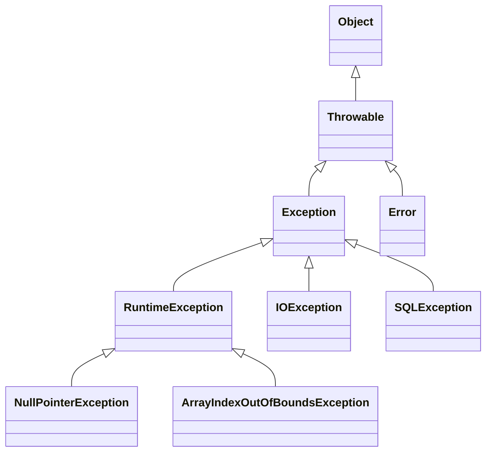

# 예외 처리 계층

자바에서는 [예외처리](%EC%98%88%EC%99%B8%EC%B2%98%EB%A6%AC.md) 를 위한 계층이 존재한다. 예외처리 문법은 [Java 의 예외 처리 Try , Catch , Finally , Resources](Java%20%EC%9D%98%20%EC%98%88%EC%99%B8%20%EC%B2%98%EB%A6%AC%20Try%20,%20Catch%20,%20Finally%20,%20Resources.md) 이 존재 한다. 

예외 또한 객체중 한 종류 이기 때문에 최상위 계층에는 `Object` 클래스가 있지만, 실제로 예외 처리 계층의 최상위 클래스는 `Throwable`입니다.

* **Throwable** : 자바 예외 처리를 위한 최상위 계층 클래스이며 이 클래스는 `Exception`과 `Error`로 구분됩니다.
	* **Exception**: 주로 애플리케이션에서 발생하는 예외를 나타내며, 체크 예외와 언체크 예외로 나뉩니다.
	    - [체크 예외 (Checked Exception)](%EC%B2%B4%ED%81%AC%20%EC%98%88%EC%99%B8%20(Checked%20Exception).md): 컴파일러가 예외 처리를 강제하는 예외로, `Exception`의 하위 클래스입니다. 파일 입출력 등과 같은 예외가 포함됩니다.
	    - **RuntimeException**: 언체크 예외로 컴파일러가 예외 처리를 강제하지 않는 예외입니다. `NullPointerException`, `ArrayIndexOutOfBoundsException` 등이 포함됩니다.
	- **Error**: 시스템 레벨에서 발생하는 심각한 오류로, 메모리 부족 등으로 인해 애플리케이션이 복구할 수 없는 상태를 나타냅니다. `Error`는 애플리케이션에서 처리하는 것이 아니라, 시스템에서 처리하도록 합니다