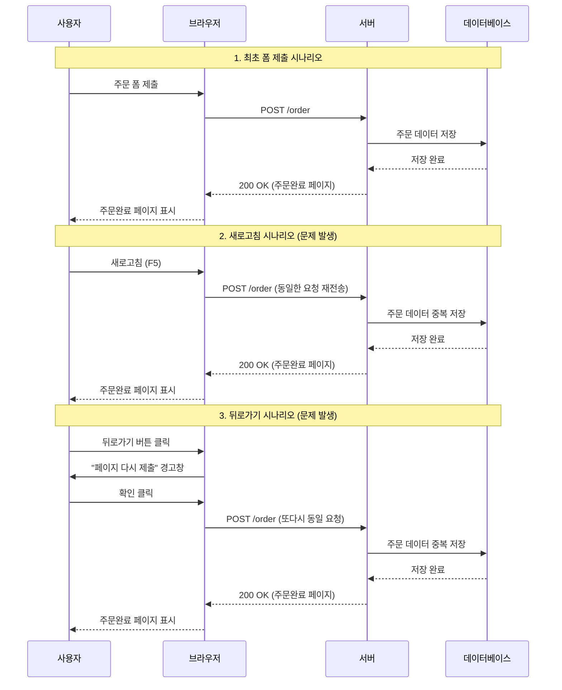
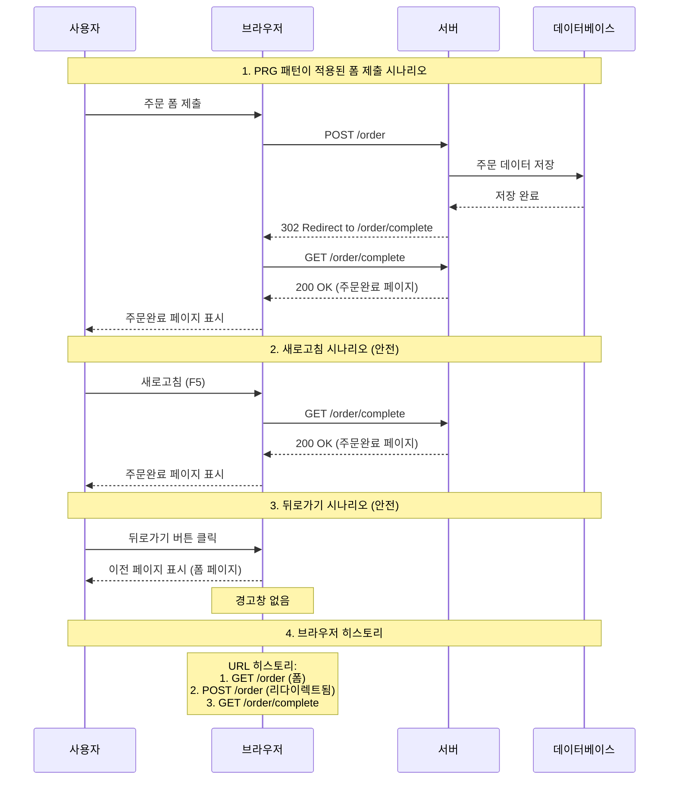

# PRG(Post-Redirect-Get)

주로 폼 제출, 결제, 주문 등 데이터를 생성/수정하는 작업에서 중복 제출을 방지하기 위한 디자인 패턴이다. **POST 요청 후 리다이렉션을 통해 GET 요청으로 전환함으로써 브라우저의 새로고침이나 뒤로가기 시 발생할 수 있는 데이터 중복 문제를 해결합니다.**

* [307 리다이렉션](3xx%20%EB%B2%88%EB%8C%80%20http%20%EC%83%81%ED%83%9C%EC%BD%94%EB%93%9C.md#^4c4274%20) 의 경우 HTTP 메서드를 그대로 유지하기 때문에 PRG 패턴에는 부적합하다.
* [301 리다이렉션](3xx%20%EB%B2%88%EB%8C%80%20http%20%EC%83%81%ED%83%9C%EC%BD%94%EB%93%9C%5E%20301.md) 을 주로 사용한다.

## PRG 패턴 사용전

1. 최초 에 사용자가 주문 폼을 작성하여 `POST /order` 로 요청을 보낸뒤 DB 에 주문 내역이 저장된다.
2. 주문이 완료된 이후 [리다이렉션(Redirection)](%EB%A6%AC%EB%8B%A4%EC%9D%B4%EB%A0%89%EC%85%98(Redirection).md) 없이 새로고침을 할 경우 1 번 에서 작성한 폼 내용이 `POST /order` 로 재 전송 된다.
3. DB 에는 중복 으로 데이터가 저장 되고 중복 주문이 들어가게 된다.

## PRG 패턴 사용후

1. 최초 에 사용자가 주문 폼을 작성하여 `POST /order` 로 요청을 보낸뒤 DB 에 주문 내역이 저장된다.
2. 저장된 이후 Server 에서는 [3xx 번대 http 상태코드](3xx%20%EB%B2%88%EB%8C%80%20http%20%EC%83%81%ED%83%9C%EC%BD%94%EB%93%9C.md) 를 사용하여 `/order/complete` 주소로 [리다이렉션(Redirection)](%EB%A6%AC%EB%8B%A4%EC%9D%B4%EB%A0%89%EC%85%98(Redirection).md) 을 하도록 한다.
3. `GET /order/complete` 페이지 이동후 Server 에서는 이에 맞춰서 주문 완료 페이지를 사용자에게 보여준다.
4. **새로고침** 을 해도 `GET /order/complete` 으로 요청을 보내기 때문에 중복 주문 이 발생할수 없다.

---

# 참고

https://www.inflearn.com/course/http-%EC%9B%B9-%EB%84%A4%ED%8A%B8%EC%9B%8C%ED%81%AC

https://programmer93.tistory.com/76

