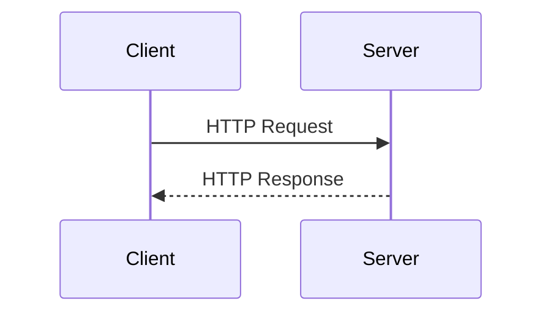

# HTTP 

`Hyper Text Transfer Protocol` 의 약자이다. 

HTTP 통신은 [무상태 프로토콜 (Stateless)](%EB%AC%B4%EC%83%81%ED%83%9C%20%ED%94%84%EB%A1%9C%ED%86%A0%EC%BD%9C%20(Stateless).md) 의 특성을 가진 통신 `규칙(Protocol)` 중 하나 이다.

`상태를 저장하지 않는 특성` 으로 인해 각 요청(Request) 는 각각 독립적으로 처리되며 동작한다. 

> [!note] INFO
> HTTP 에서 의 상태 는 주로 `세션 정보` 혹은 `연결의 맥락` 을 의미 한다.
> 예를들어 고객이 음식을 주문할 때마다 원하는 음식, 조리 방법, 추가 요청 등을 모두 다시 전달해야 합니다. 
> 만약 고객이 특별한 요구사항(예: "전에 맵게 해달라"는 요청)을 했다면, 그 정보는 주문할 때마다 새로 이야기해야 합니다.
> 
> 이 처럼 이전에 대한 정보 를 여기서 상태라고 얘기한다.

## HTTP 역사

HTTP 는 지금까지 버전 업을 계속 해오면서 버전 3 까지 나온 상태이다. 현재 가장 많이 사용되는 버전의 경우 `HTTP/1.1` 을 주로 사용하고 있으며 /2 와 /3 버전도 점점 증가하는 추세이다.

해당 통신이 현재 사용하고 있는 HTTP 버전의 경우 개발자 도구를 사용하여 다음과 같이  확인이 가능하다.

- HTTP/0.9 1991 년 Get 메서드만 지원 , HTTP 헤더 X
- HTTP/1.0 1996 년 메서드 , 헤더 추가
- HTTP/1.1 1997 년 가장 많이 사용
    - RFC2068 -> RFC2616 -> RFC7230~7235
- HTTP/2 2015 년 성능 개선
- HTTP/3 진행 중 TCP 대신 UDP 사용 하여 성능을 개선중에 있다.

## 기반 프로토콜

* TCP 통신의 경우 HTTP/1.1 , HTTP/2 기반을 사용하여 만들어진 통신 이다
* UDP 통신은 가장 최신 버전인 HTTP/3 기반을 사용하여 만들어진 통신이다.