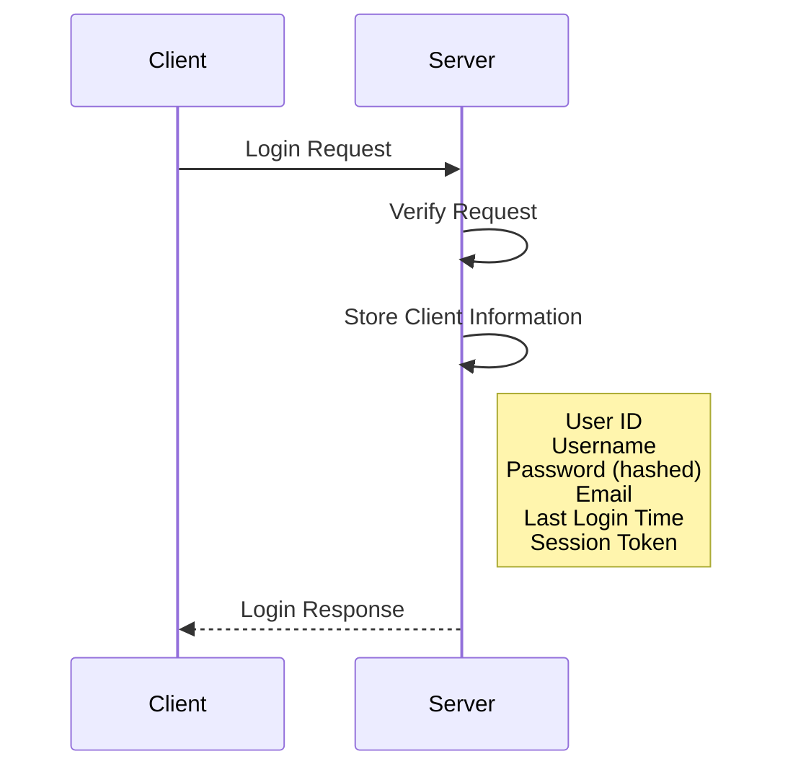
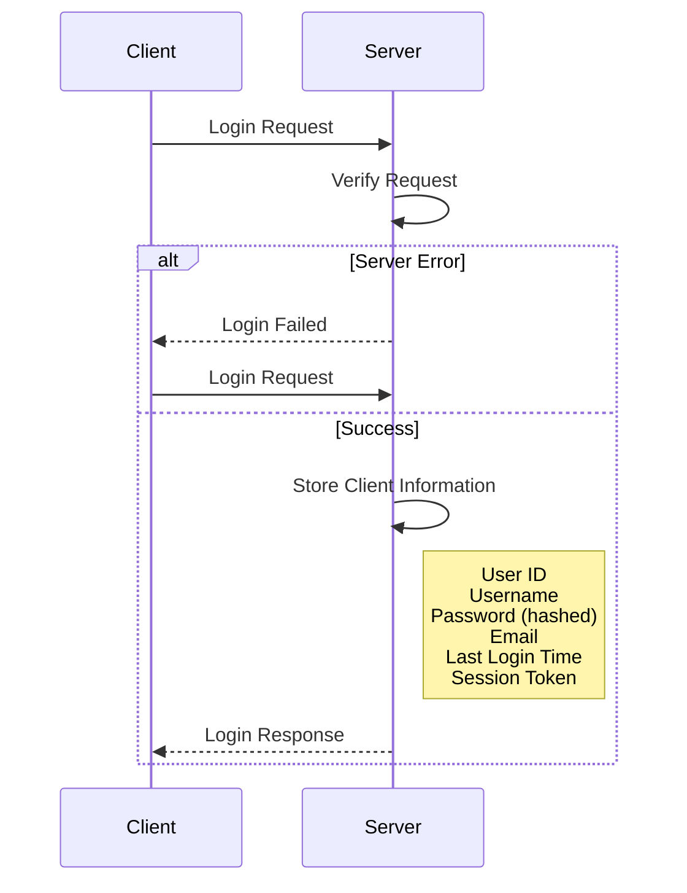

# 상태유지 프로토콜 (Stateful)

[무상태 프로토콜 (Stateless)](%EB%AC%B4%EC%83%81%ED%83%9C%20%ED%94%84%EB%A1%9C%ED%86%A0%EC%BD%9C%20(Stateless).md) 프로토콜 과는 정반대 되는 개념으로 `서버에서 클라이언트의 상태를 보존` 하는 프로토콜을 의미 한다.

## Stateful 프로토콜 예시

### TCP 통신

TCP 통신 의 **3-way handshaking** 과정이 대표적인 Stateful 프로토콜 이다. 

## Stateful 프로토콜 단점

Stateful 프로토콜의 단점은 **서버에서 클라이언트의 상태를 보존한다는 점** 이다. 만약 클라이언트 와 서버 간 통신이 이뤄 지던 도중 문제가 발생하여 서버를 교체 혹은 재시작 했을 경우 **기존의 클라이언트의 상태값** 은 이미 사라진 상태이기 때문에 정상적인 응답 처리가 불가능하다.

Stateful 프로토콜은 **서버에 의존적**이며, 서버에 장애가 발생하면 기존 클라이언트의 상태 정보가 소실되어 복구가 어려워지는 단점이 있다.

아래와 같이 클라이언트에서 `로그인 을 요청(Login Request)` 하게 되며 서버에서는 이러한 요청 정보에 대해 확인후 `클라이언트 정보를 서버에 저장(Store Client Info)`하게 될 것이다.

하지만 이 과정중 `서버의 에러(alt)`가 발생하게 될 경우 기존에 사용하던 로그인 정보는 사라진 상태이기 때문에 다시 로그인을 요청하여 재 연결을 시도해야 한다.

또한 Stateful 프로토콜은 **수평 확장의 한계**가 있습니다. 사용자가 많아지면 각 사용자의 세션 정보를 효과적으로 관리하기 어려워지며, 서버 개수를 늘려도 상태 정보 처리에 한계가 있습니다.

이처럼 Stateful 프로토콜 은 [무상태 프로토콜 (Stateless)](%EB%AC%B4%EC%83%81%ED%83%9C%20%ED%94%84%EB%A1%9C%ED%86%A0%EC%BD%9C%20(Stateless).md) 의 비해 상대적으로 서버에 의존적이며, 장애 발생 시 복구가 어렵다는 단점이 있다.
